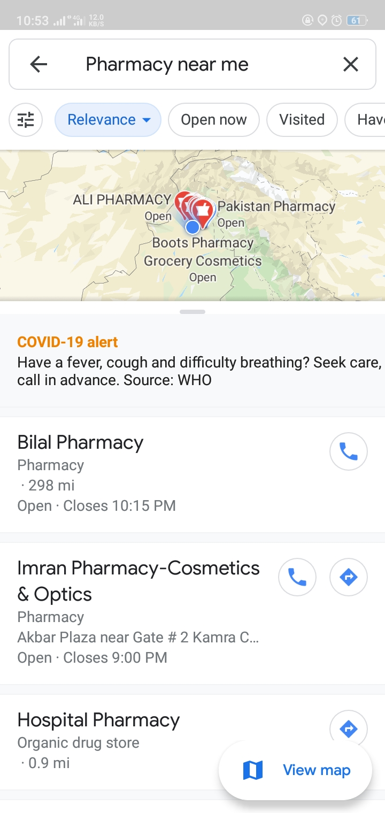
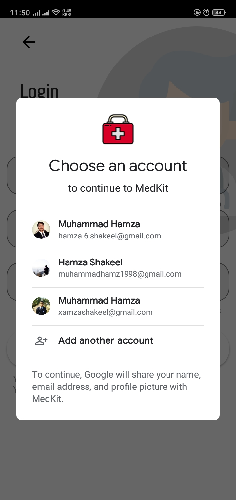

# medkit

It's a Pharmacy application that help you in curing basic symptoms or diseases with medicines available in your homes.

## Features
It holds two major parts
1. Doctor
2. Patient

# Doctor
A doctor can perform various funtions like:
1. Adding Diseases/Medicines
2. Viewing Diseases/Medicines
3. Deleting Diseases
4. Profile Updating

# Patient
A patient can perfrom various functions like:
1. Viewing Medicines/Diseases
2. Viewing Doctor Details who posted the disease
3. Getting location of nearest pharmacy using Google Maps Application

# Screen Shots

## Welcome and User Type
 

## Doctor Part
   

## Patient Part
     

## Gmail Auth

